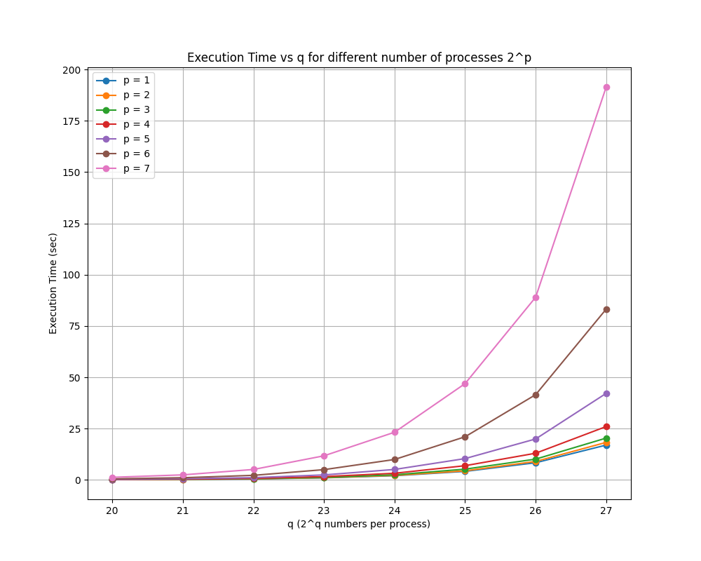

# AUTH - Parallel and Distributed Systems - Homework 2: Bitonic-Sort using MPI

## Project Description

This project implements a distributed sorting program using **MPI**, based on the Bitonic Sort algorithm. The program sorts \( N = 2^{(q + p)} \) integers in ascending order across \( 2^p \) processes, each starting with \( 2^q \) random integers. It follows the Bitonic Sort method, combining local sorting and data exchange between processes to achieve the final result. The program validates the sorting and compares the performance of the parallel implementation for different values of \( q \) and \( p \). 

To evaluate the efficiency of the parallel approach, the program was tested on the **Aristotelis cluster** for high-scale performance. It was also tested against qSort and serial BitonicSort to verify speedup achievement.

For a detailed description of the algorithm and implementation, please refer to the project [report](docs/report.pdf)

---

## Table of Contents
1. [Instructions](#instructions)
2. [Tests](#tests)
3. [Credits](#credits)

---

## Instructions

1. **Prerequisites**:
   - Ensure OpenMPI is installed on your system.

2. **Clone the Repository**:
   ```bash
   git clone <https://github.com/mariaxarisi/Bitonic-Sort.git>
   cd <repository_folder>
   ```

3. **Compile the program** using the following command:
    ```bash
    make
    ```

4. **Run the program** using the following command. Subsitute <p> and <q> with positive integeres:
    ```bash
    make run P=<p> Q=<q>
    ```

    **Note**: Before running the program on your machine, check the number of CPU cores available and adjust the `p` value accordingly. Since \( 2^p \) processes are used, ensure that \( 2^p \) does not exceed that number to avoid error messages.  
    For example, if your machine has 8 CPU cores, set \( p \) up to 3 (since \( 2^3 = 8 \)).

5. **Expected Output**:
    ```bash
    Sorted Sequence
    Time: <Execution Time>
    Do you want to print the sorted sequence? (y/n):
    ```

    **Note**: If you want to see the sorted sequence, press the character 'y' and then enter. However, ensure first that there is enough space to gather all the numbers in one process.

6. **Clean up** the directory of the files generated using the following command:
    ```bash
    make clean
    ```

---

## Tests

This project was tested on the **Rome** partition of the **Aristotelis cluster** provided by the Aristotle University of Thessaloniki. Testing was done on a single node, utilizing all of its 128 CPU cores. Below is a visual representation of the execution time relative to the **Q** parametre, for different values of **P**.



---

## Credits

Written by Charisi Maria and Kostomanolaki Maria Sotiria in December 2024 - January 2025.

